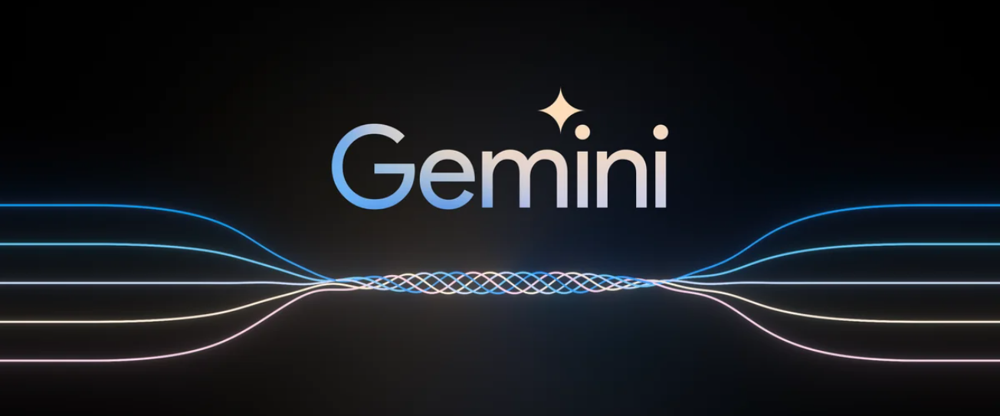

## Get the image description from GEMINI AI: Google's largest and most capable AI model

## Introduction

This is a Python Streamlit Web Application where user can upload a image and get its description.

### Reference Links

- [Streamlit Documentation](https://docs.streamlit.io/)  
- [Gemini AI Blog](https://blog.google/technology/ai/google-gemini-ai)  
- [Try Gemini AI in browser](https://makersuite.google.com/app/prompts/new_freeform)
